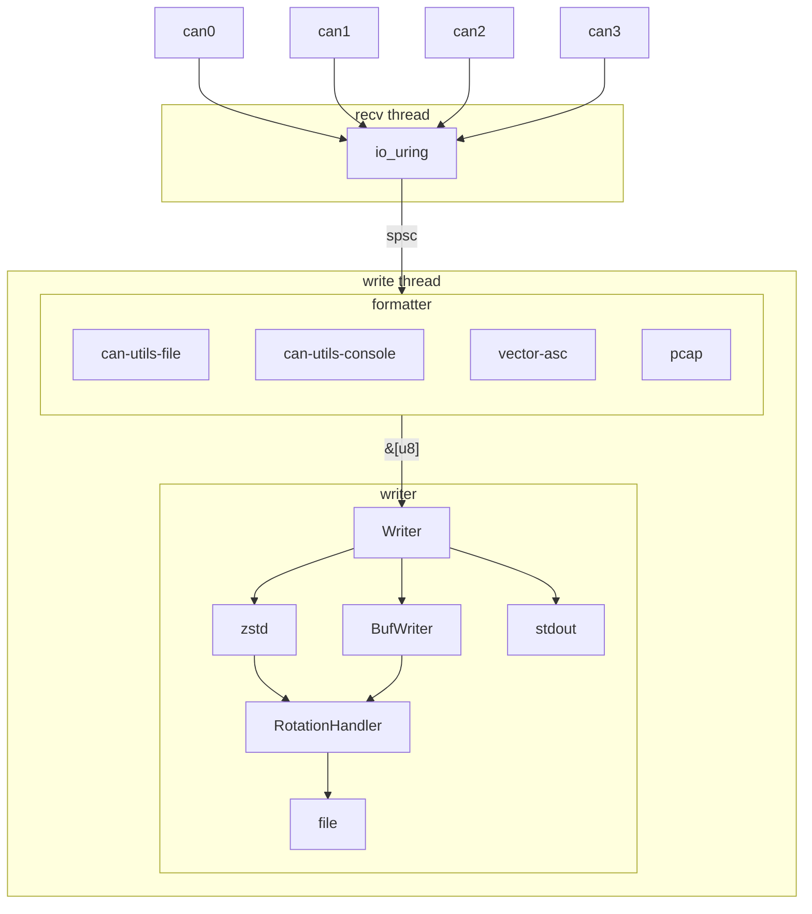

# candumpr architecture

Status: **PROPOSAL**

# Scope

This document proposes the core data pipeline for candumpr.

# Goals

The baseline implementation that this proposal intends to improve upon is using one can-utils
`candump` process to do blocking receives for each logged network. On low-spec systems, this results
in a noticeable performance impact, which would be manageable, except that the logging on those
systems is ancillary to the application software those systems are primarily responsible for.

Paraphrasing the goals from [01-goals.md](/docs/design/candumpr/01-goals.md), the overall goal for
candumpr is to reduce the system performance impact of using candump in this manner.

# Proposed architecture

The proposal is to use one shared receive thread that uses io_uring multishot to batch receives
across multiple networks. This reduces the number of syscalls per frame to less than one-per frame.
This reduces the overall context switching cost when logging multiple networks.

As I intend to support systems with slow disks (`write()` syscalls that sporadically block for
multiple seconds), the receive thread is decoupled from the format + write thread, which also
services multiple networks. See: <https://github.com/linux-can/can-utils/issues/381> for additional
background.

Assume a worst-case throughput of 8x 500kbaud networks at 100% busload. That's 500KB/s of raw data,
plus some inflationary factor from the formatter (formatting as ASCII adds a constant scalar to the
throughput). This is well within the formatting, compression, and write capabilities of a single
thread.

## Receiver detail

There are many ways in which a receiver thread or threads could be built using Linux syscalls:

* candump-style blocking `read()` in a dedicated thread per interface
* `epoll()` and non-blocking `read()` to wake up and receive frames one-by-one when they arrive
* `epoll()` and non-blocking `recvmmsg()` to receive as many ready frames as possible on any wakeup
* `io_uring` singleshot - each SQE represents one `read()` - after reading from a socket, the `Recv`
  opcode is resubmitted.
* `io_uring` multishot - one SQE submitted for each socket with the `RecvMsgMulti` opcode and
  `submit_with_args(batch=4, timeout=100ms)` to wait until `batch` frames are ready to receive
  together from any interfaces.

The multishot io_uring receiver strategy results in _significantly_ fewer syscalls and context
switches per ready CAN frame, resulting in overall better system performance, and degradation under
contention.

The batch size could be significantly increased when logging to a file, but when logging to
`stdout`, we should use a lower batch size (like 4) to facilitate watching a live log. We cannot
infinitely increase the batch size - there's a tipping point at which if we increase it too far, we
run the risk of filling up the recvbuf. A batch size of 32 or 64 seems like a reasonable upper
limit.

## Formatter detail

Use a Strategy design pattern to format the CAN frame into a bytearray to be written. The output is
a bytearray that may include multiple frames, and an indication of which interface the formatted
frames came from (so they can be written to the appropriate file). The bytearray never always
includes full frames; a frame will never be split across multiple bytearrays.

## Compression detail

There's three approaches I've been able to find:

1. Independent concatenated frames - periodically call `.finish()` on the zstd `Encoder`, and
   probably call `fsync()` as well

   Output is decompressable with `zstd -d`. I think with large-ish frames (1MB?) the compression
   ratio might be good enough the simplicity of this approach wins over the complexity of managing
   training dictionaries in a production context.

2. Independent concatenated frames with a pretrained dictionary - train a dictionary on CAN data

   Output is decompressable with `zstd -d -D can.dict`. It might be best to train a dictionary
   specific to each format? We would need to maintain and ship pre-trained dictionaries, and make
   them available to engineers troubleshooting CAN traffic.

   I think it could be easy to add a configuration option to candumpr to provide your own zstd
   dictionary, in which case candumpr's own implementation doesn't bear the burden of the dictionary
   training, that's offloaded onto the consumer.

3. Prefix-linked frames - persist the compressor state from previous frames when compressing the
   next.

   Best compression ratio. Output is **not** decompressable with `zstd -d`, would need to implement
   a custom decompressor, which I think eliminates this option from consideration.
